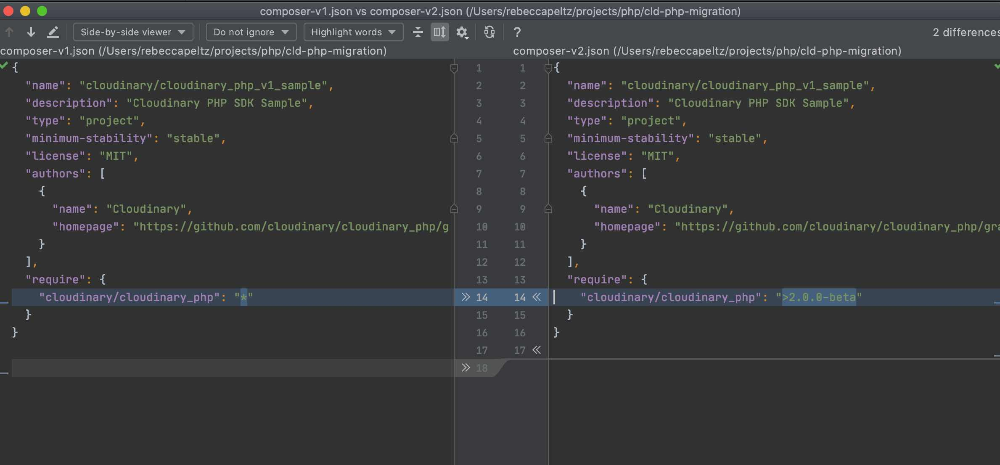
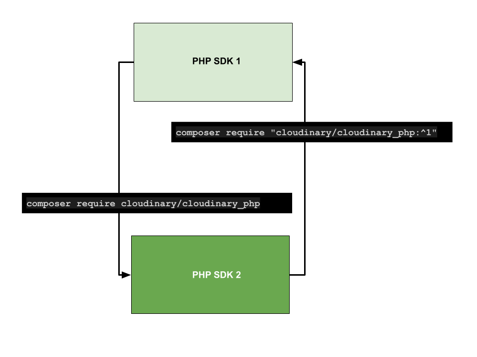

# Cloudinary PHP V2 Migration

## Introduction 

The most significant changes in the Cloudinary PHP V2 SDK are related to creating transformations.  This migration tutorial is provided to help you see how to upgrade without having to make a lot of changes to your existing transformation code.

In this tutorial we'll follow this process:

- start with a baseline web page `index_v1.php`
- execute composer commands to upgrade from V1 to V2
- demonstrate the V2 code that will produce the same results as V1 with minimal changes in `index_v2.php`


Here’s a mapping of V1 code to V2

| V1  | V2 |
| ------------- | ------------- |
| Cloudinary::config  |Cloudinary\Configuration\Configuration or Configuration::instance|
|\Cloudinary\Uploader::upload()  |(new Cloudinary\Api\Upload\UploadApi())->upload() |
|(new \Cloudinary\Api())->resources() |(new Cloudinary\Api\Admin\AdminApi())->resources()|
|cloudinary_url | Cloudinary\Asset\Media::fromParams()|
|cl_image_tag |Cloudinary\Tag\ImageTag::fromParams() |
|cl_video_tag |Cloudinary\Tag\VideoTag::fromParams() |
|cl_video_thumbnail |Cloudinary\Tag\VideoThumbnail::fromParams()|  

---


If you want to learn the new transformation syntax,  take the course *Intro to Cloudinary Using PHP SDK* through Cloudinary Training.  The transformation syntax changes introduce Object Oriented classes that *enhance discoverability in your IDE*.  The syntax also provides *Method Chaining* based on [Fluent Interface Concepts](https://en.wikipedia.org/wiki/Fluent_interface). 

In this course we'll walk you through the upgrade process starting with a V1 PHP web page and ending with an V2 PHP webpage. 

During this process we'll:
- Look at sample code using the **Upload** and **Admin** APIs
- Look at creating transformations using the singleton method for creating an  **instance** of Cloudinary and the `fromParams` method. These methods will allow us use arrays as we do in V1 to create transformations. Migration to V2 will then involve simple string replace updates to our code.
- Demonstrate discoverability in the UI


## Setup and Configuration

## Serving PHP Web Pages

To server the web pages in this tutorial you can use:

- a server that you have already set up
- for Mac OS v10 or greater you can use the build in PHP server `php -S 127.0.0.1:8000`
- for Windows [WAMP](https://www.w3resource.com/php/installation/install-php-on-windows.php)


### Credentials  
There are many ways that you can provide the CLOUDINARY_URL credentials `CLOUD_NAME`, `API_KEY`, and `API_SECRET` to your environment.  In this tutorial, we'll use a bash export command.  You can get your CLOUDINARY_URL from the Cloudinary console.

```
export CLOUDINARY_URL=cloudinary://<api_key>:<api_secret>@<cloud_name>
```

The Cloudinary PHP V2 provides 2 different methods for instantiating Cloudinary: 
1. A **constructor** method will allow for the creation of multiple instances of Cloudinary which enables the developer to access multiple clouds 
within a single script.  Each instance can use different credentials so that multiple clouds can be accessed with in a single script.
2. A static **instance** method will allow for the creation of a single instance of Cloudinary.

For the purposes of migration, we will be using the static **instance** method to demonstrate V2 code.  

The goal of this migration guide is to simplify migration. Therefore, we'll be demonstrating simple techniques for modifying existing V1 code to make it V2 compliant.  


### Course File Contents
The files that we'll be focusing on in this migration exercise are:

1. **composer.json**    
Start with a reference to a V1 Cloudinary package. Uninstall V1 and install the 
V2 Cloudinary package to begin migration. For demonstration purposes, there is a `composer-v1.json` file and a `composer-v2.json` file.  If you examine them, you'll see that the only difference is the Cloudinary package.  



2. **index-v1.php**  
This is a php web page that relies on V1 syntax. Before we upgrade, we'll review the code
 offered in V1 that we'll be modifying as part of the migration. 

3. **index-v2.php**    
This is a php page containing the same functionality as *index-v1.php*. This page allows us use the 
same syntax for specifying transformations in V2 as V1 with just a few code changes.  The code change we'll make to migrate is to replace the `cloudinary_url` function which returns a string with `ImageTag::fromParams` which returns an object.  The `toString` function returned by `fromParams` is the string we produced with `cloudinary_url`.
Our transformation code migration is essentially a find/replace of `cloudinary_url` with `ImageTag::fromParams`.

4. **index-new-syntax.php**
We'll look how to use the new syntax to create the same asset transformation that we created in the V1 and V2 scripts.  If you want to learn more about the new syntax sign up for the **Intro to Cloudinary using PHP** course on the Cloudinary Academy.

### Practicing the Migration
We can move forward and backward by using composer to load the desired version.  The default version is V2.
<p align="center">

</p>

Move to V1
```bash
composer require "cloudinary/cloudinary_php:^1"
```

Move to V2
```bash
composer require "cloudinary/cloudinary_php:^2"
```

## Running V1 Code as a Baseline 

Before migrating to V2 and looking at the syntax, we can note that the composer.json supplied with this 
repo is set up for V1.  Let's execute code from V1 as a baseline.

To install the PHP SDK execute the following:

```bash
composer update
```

With the V1 package installed, you should be able to run the [index-v1.php]("./index-v1.php") web page and view in your browser.
This syntax and the functions used should look familiar to a Cloudinary PHP developer and are provided as a baseline for migrating the code.


1. Load dependencies.

2. Provide Cloudinary credentials if not made available in environment already.  We've put the export command in a .env file, so this can be run before executing the script.

```bash
. ./.env
```

3. Create the single instance for the CLOUD_NAME in your script.

```php
Configuration::instance();
```

3. Upload a Cloudinary Logo using the Upload API and view upload response on web page.
```php
$upload = new \Cloudinary\Uploader();
echo '<pre>';
print_r($upload->upload("https://cloudinary-training.github.io/cld-php-migration/images/cloudinary_icon_blue.png",
['public_id'=>'cloudinary_icon_blue']));
echo '</pre>';
```
4. Execute the `assets` function from the Admin API to view assets in the cloud on the web page. This function was called `resources` in V1.
```php
$api = new \Cloudinary\Api();
echo '<pre>';
print_r($api->assets());
echo '</pre>';
```
5. Generate a URL using the URL helper utility and render the URL string on the web page.
```php
$url =  cloudinary_url(
    public_id,
    [
        "secure" => true,
        "transformation" => [
           
        ],
    ]
);

```
6. Generate an image tag using the image tag helper utility and render the image on the web page.
```php
$image = cl_image_tag(
    public_id,
    [
        "secure" => true,
        "transformation" => [
            
        ],
    ]
);

```

## Migrate From V1 to V2

Run composer to install the default V2 PHP SDK.

```bash
composer require "cloudinary/cloudinary_php"
```  


## Running V2 Code

With the V2 package installed, you should be able to run the [index-v2.php]("./index-v2.php") web page and view in your browser.

1. Load dependencies.
```php
require_once __DIR__ . '/vendor/autoload.php';
```

2. Provide Cloudinary credentials and set up instances of Cloudinary.
```php
echo Configuration::instance()->account->cloudName;
```

3. Upload a Cloudinary Logo using the Upload API and view upload response on the web page.  The V2 is object oriented and name-spaced.  You will need to import classes with the `use` command.
```php
use Cloudinary\Api\Upload\UploadApi;
$upload = new UploadApi();
```

4. Execute the resources function from the Admin API to view assets in the cloud on the web page.
```php
use Cloudinary\Api\Admin\AdminApi;
$api = new AdminApi();
```

5. Generate a URL using the URL helper utility and render the URL string on the web page. The `Media.fromParams` command can be used to generate a URL when you are working with the Cloudinary **instance**.  A *find/replace* in your code will allow updates fromV1 to V2 by replacing `cloudinary_url` with `Media::fromParams`.  Then
you can leave your transformation code spec the same.  
```php
use Cloudinary\Asset\Media;
$url = Media::fromParams(
    public_id,
    [
        "secure" => true,
        "transformation" => [
            ...
        ]
    ]
);
```

6. Generate an image tag using the image tag helper utility and render the image on the web page. You can replace `cl_image_tag` with `ImageTag::fromParams` to create an image tag in V2. In this case you would import the 
`Cloudinary\Tag\ImageTag`.
```php
use Cloudinary\Tag\ImageTag;
//
$image = ImageTag::fromParams(
    public_id,
    [
        "secure" => true,
        "transformation" => [
            ...
        ]
    ]
]);

```
7.  The PHP V2 functions return objects that also have functions. This makes it possible to chain your operations.  Chaining using V2 functions creates a natural flow when building transformations.  Because the code is Object Oriented, you IDE can help you with code completion.  You can take the output from a `fromParams` function and chain V2 code.  Once you've migrated, this is a good way to start incorporating new V2 syntax into existing code if you don't want to do a full rewrite, but want to start using V2 syntax.

In this example we chain a `resize` function call on to the result of the image generator above.

```php
$image->scale(100);
echo $image;
```

## Transformation created with V2 vs V1 Syntax

If you start using the V2 Transformation syntax, you will notice that transformation URL that you produced using V1 may look different that the URL you produced using V2.  What you will likely see are more `/` in your URL separating what are called **Action Groups** in V2.  The entire URL is still 1 transformation but it is broken down by Action Group instead of the way that you constructed the Array in V1.

## Resources:

[Cloudinary source code](https://github.com/cloudinary/cloudinary_php/blob/2.0.0-beta)  
[Migration Guide](https://cloudinary.com/documentation/sdk2_migration)

## Suggested IDE's
The Cloudinary PHP SDK is Class based.  This means that your IDE can provide help learning the language.  With code completion, you can discover Classes, functions, constants, and enumerated types.
Here are some suggestions for IDE's that can help with PHP code completion and auto import:

* PHP Storm
* Netbeans
* Aptana Studio
* Eclipse
* Visual Studio with Extensions PHP Namespace Resolver and Intelephense
* ZendStudio
